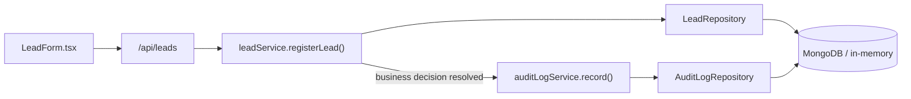

# Audit Logging — Design Review

**Status: Approved and implemented.** See `CHANGELOG.md`'s "Audit
Logging" entry for the full file list and live verification. The three
open questions below were resolved as follows:

1. **Log only meaningful business events.** `lead.created` is logged;
   `lead.duplicate_touched` is not. Same principle applied consistently
   to the two services built after this review: `campaign.created` is
   logged, a duplicate campaign-code rejection is not;
   `registration.created` is logged, an idempotent duplicate-registration
   return is not.
2. **Retention: 365 days by default**, configurable via
   `AUDIT_LOG_RETENTION_DAYS` (`config/auditLog.ts`). Implemented as an
   application-level `pruneExpiredAuditLogs()` function with a pluggable
   archiver — deliberately **not** a MongoDB TTL index, since TTL
   deletion has no hook to archive first (see §7). Not wired to run
   automatically — no scheduler exists in this app, and an
   unauthenticated deletion trigger would be worse than the gaps already
   flagged on `/api/campaigns`/`/api/registrations`.
3. **Rejected/failed requests are not audited** — *updated by
   Authentication (Module 9).* This was the flagged revisit point:
   "once authentication/authorization exist and 'who attempted this' is
   answerable." They now are. `category: "security"` has a real
   producer — `lib/services/auditLog/securityAuditLogService.ts` — for
   exactly the events this decision anticipated: login success/failure,
   logout, refresh-token reuse (theft detection), and role-gate
   rejections (`ForbiddenApiError`/`UnauthorizedApiError`, recorded from
   `withApiRoute.ts`). Business-event rejections (a duplicate campaign
   code, an idempotent duplicate registration) remain un-audited — that
   part of decision 3 wasn't about authentication and still stands; see
   the Authentication changelog entry for exactly which auth events are
   audited and why routine token refresh isn't one of them.

**Additional requirement incorporated:** events are now formally
separated into three categories — **Business Audit Events** (this
document's subject, persisted, permanent, `category: "business"`),
**System/Operational Logs** (a separate, pre-existing, ephemeral
mechanism — see the new `lib/logger.ts` shared primitive), and
**Security Audit Events** (`category: "security"`, `securityAuditLogService`
— no producer at the time this document was approved, now populated by
Authentication as described above). Detailed below in §1 and §3, and now
reflected in `lib/db/repositories/types.ts`'s `AuditCategory` type.

---

*Original design review follows, unmodified except for this status
header — the reasoning below held up through implementation, including
one explicit self-correction (§5) that implementation confirmed was the
right call.*

**Starting point:** the `AuditLog` schema, repository (in-memory +
MongoDB), and registry entry already exist (built in the Database Layer
module) but have **zero callers anywhere in the codebase** — this is a
genuine blank slate, not a retrofit. That matters for a few of the
recommendations below: because the collection has never been written to,
extending its schema now costs nothing (there's no existing data to
migrate or backfill).

---

## Executive summary

Audit logging should be a **service-layer concern**, added as a new
`lib/services/auditLog/` module that other business services (`leadService`,
`campaignService`, `registrationService`) call explicitly at the specific
points they've already decided something audit-worthy happened — not an
automatic repository/ORM hook, and not a new event bus. Writes should be
**awaited but non-blocking on failure**: the audit write attempt
completes before the API responds (so there's no "did it actually
happen?" ambiguity in this serverless deployment), but if it fails, the
failure is logged and swallowed, never propagated to fail the underlying
business operation. This is the same pattern already validated elsewhere
in this codebase — see §9.

Two things need your sign-off before implementation, flagged inline and
summarized at the end: **retention period**, and **whether to log failed
duplicate/rejected attempts** or successful state changes only.

---

## 1. Where Audit Logging should live in the architecture

Three places it could plausibly live, and why the third is the right one:

**Repository/ORM-level (automatic hooks on every `create`/`update`).**
Rejected. This captures *what* changed but not *why* — the business
context that makes an audit trail actually useful. `leadService`'s
duplicate-touch path is a good example: at the repository level it's
just "a Lead document was updated," but the business-meaningful fact is
"a repeat submission was recognized and merged instead of creating a
duplicate." That reasoning only exists in the service layer, after
validation and dedup logic have already run. Auto-logging at the
repository level would produce technically-accurate, semantically-empty
entries.

**API-layer cross-cutting concern (alongside `lib/api/logger.ts`'s
request logging).** Rejected as the primary home, though related.
`lib/api`'s structured logger is **operational/diagnostic** logging —
ephemeral, stdout-captured, for developers debugging a live incident.
AuditLog is a **business/compliance record** — permanent, queryable,
tied to domain entities, for answering "what happened to this Lead /
Campaign / Registration and when." These serve different consumers and
different retention needs (§7) and shouldn't be merged into one
mechanism just because both are called "logging." They should, however,
be *correlated* — see the `requestId` proposal in §3.

**Service layer (recommended).** A new `lib/services/auditLog/` module,
structured exactly like `campaigns` and `registrations`: a thin service
(`auditLogService`) wrapping the already-built `AuditLogRepository`, with
its own barrel. Other business services import it and call
`auditLogService.record(...)` at the point they've already resolved what
happened. This is the least novel option — it reuses a pattern this
codebase has already applied three times, rather than introducing a
fourth kind of architectural concept for one feature.



`auditLogService` sits *beside* `leadService`/`campaignService`/
`registrationService`, not above or below them — a sibling utility they
each depend on, the same relationship `registrationService` already has
with `getLeadRepository()`/`getCampaignRepository()` for cross-entity
lookups.

---

## 2. Which actions should generate audit events

Not everything that happens is audit-worthy. The heuristic I'd apply:
**would a human reviewing this entity's history want to see this
event?** Read-only operations, internal retries, and validation failures
generally fail that test. State changes that a person or process
deliberately caused generally pass it.

Concretely, against the services that exist today:

| Service | Event | Recommend logging? | Reasoning |
|---|---|---|---|
| Lead | `lead.created` | **Yes** | The canonical "new lead entered the system" record |
| Lead | `lead.duplicate_touched` | **Lean no, flagged for your call** | This is the highest-volume path in the app — a popular lead magnet could get the same phone/email resubmitted dozens of times. Logging every touch turns AuditLog into mostly noise from one entity. See open question below. |
| Campaign | `campaign.created` | **Yes** | Low-volume, deliberate, admin-initiated |
| Campaign | `campaign.code_collision_rejected` | **No, not in v1** | A *failed* attempt, not a state change. See "business audit trail vs. security audit trail" below. |
| Registration | `registration.created` | **Yes** | Exactly the kind of record a compliance/business audit trail exists for |
| Registration | `registration.duplicate_returned` | **Lower priority, optional** | Lower volume than Lead's duplicate path (registration requires an existing Lead + explicit action), but still not a state change |
| *(future)* | `lead.status_changed`, `campaign.status_changed`, `registration.status_changed` | **Yes, high value** | None of these mutation paths exist yet (Lead/Campaign have no admin-driven status-change service method today) — the highest-value audit events in this whole system will be these, once built |

**Business audit trail vs. security audit trail — a distinction worth
naming.** Some audit-logging designs *do* log failed/rejected attempts
(useful for detecting abuse patterns, e.g., "someone tried to create the
same campaign code 50 times"). That's a legitimate but different use
case from "what happened to this data," and it overlaps with what
`lib/api`'s rate limiter and `request.handled_error` logs already give
you today. Given there's no auth system yet — so "who tried" isn't even
answerable — I'd defer failed-attempt auditing to whenever authentication
exists and "who" becomes meaningful, rather than building it now against
an anonymous actor.

---

## 3. The AuditLog schema

**What already exists** (Database Layer module, unused):

```ts
interface AuditLogEntry {
  id: string;
  action: string;
  entityType: "Lead" | "Campaign" | "Registration";
  entityId: string;
  actorId?: string;
  metadata?: Record<string, unknown>;
  createdAt: string;
}
```

This is a reasonable v1 foundation. Three additive gaps worth closing
before the first real write, all backward-compatible (no migration
needed — the collection is empty):

**`actorType: "system" | "user" | "api"`.** Right now `actorId` is
always `undefined` (no auth exists), which is fine, but there's no way
to distinguish "the system did this automatically" (a dedup touch) from
"an admin did this" (once auth exists) purely from the data. I'd add
this as a required field, defaulting to `"system"` today, so queries
like "show me every human-initiated change" are possible the moment
auth lands, without needing to reinterpret old entries.

**`requestId?: string`.** Correlates an audit entry to the exact HTTP
request that caused it, via `lib/api`'s `ApiRouteContext.requestId`
(already generated per-request, currently only used for operational
logs). Being able to jump from "this Registration looks wrong" to "here
are the exact structured logs for the request that created it" is a real
forensics capability, and it's nearly free to wire — `requestId` already
exists at the API layer, it just isn't threaded down into service calls
yet (a §5 implication).

**A documented metadata convention, not a schema change.** `metadata`
staying `Mixed` is correct — a rigid per-action schema would need a
migration every time a new action type is added. The discipline should
live in TypeScript at the call site instead: define a metadata shape
per action name (e.g., `LeadDuplicateTouchedMetadata = { previousSource:
string; newSource: string }`) so `auditLogService.record()` calls are
still compile-time checked, while storage stays flexible. Detailed in §4.

**Not recommended for v1:** storing IP address or user agent in every
entry. `lib/api/clientIp.ts` already extracts this and could be
attached, but doing so by default adds PII-adjacent data to a
permanent, append-only collection for routine business events — a
retention/privacy cost (§7) that isn't justified until there's a
concrete security-investigation use case that needs it. If that need
arises, add it selectively (metadata for specific security-relevant
actions), not universally.

Proposed shape:

```ts
interface AuditLogEntry {
  id: string;
  action: string;
  entityType: "Lead" | "Campaign" | "Registration";
  entityId: string;
  actorId?: string;
  actorType: "system" | "user" | "api";   // NEW
  requestId?: string;                      // NEW
  metadata?: Record<string, unknown>;
  createdAt: string;
}
```

---

## 4. The service interfaces

```ts
// lib/services/auditLog/types.ts (proposed — not created)

export type AuditActorType = "system" | "user" | "api";

export interface RecordAuditEventInput<TMetadata = Record<string, unknown>> {
  action: string;
  entityType: AuditEntityType;
  entityId: string;
  actorId?: string;
  actorType?: AuditActorType;   // defaults to "system" in the service
  requestId?: string;
  metadata?: TMetadata;
}
```

The generic `TMetadata` parameter is the "typed per-action metadata"
mechanism from §3 — each calling service defines its own metadata shape
and gets it checked at the call site:

```ts
// Illustrative call site inside leadService.ts (not implemented):
await auditLogService.record<{ program?: string; source: string }>({
  action: AUDIT_ACTIONS.LEAD_CREATED,
  entityType: "Lead",
  entityId: created.id,
  metadata: { program: created.program, source: created.source },
});
```

`AUDIT_ACTIONS` would be a small constants module
(`lib/services/auditLog/actions.ts`) defining action-name strings once
(`LEAD_CREATED: "lead.created"`, etc.) — avoids magic strings and typos
scattered across three services, and gives one place to see the full
list of events the system considers audit-worthy.

```ts
// lib/services/auditLog/auditLogService.ts (proposed, sketch only)

export const auditLogService = {
  // Never throws — see §8/§9. Returns the entry on success, undefined
  // on failure (logged internally via lib/api's logger, not this
  // return value — callers that don't care can ignore the return).
  async record<TMetadata>(
    input: RecordAuditEventInput<TMetadata>,
  ): Promise<AuditLogEntry | undefined> { ... },

  // Thin pass-through to the existing, already-built repository method.
  async listForEntity(
    entityType: AuditEntityType,
    entityId: string,
  ): Promise<AuditLogEntry[]> { ... },
};
```

One deliberate interface decision: `record()` does **not** accept a
`session` parameter, even though the underlying `AuditLogRepository.record()`
already supports one. That's not an oversight — see §5/§8/§9 for why
audit writes are recommended to run *outside* any business transaction.

---

## 5. How it integrates with the existing Service Layer

Each of the three existing services gains one new dependency
(`auditLogService`) and one new call, placed **after** the business
decision has fully resolved — never before, never speculatively:

- **`leadService.registerLead()`** — call `auditLogService.record(...)`
  right before returning, once for the `lead.created` path. (The
  duplicate-touch path is the open question in §2/§9.)
- **`campaignService.createCampaign()`** — call it right before
  returning on the success path only, after `repository.create()` has
  actually succeeded (including surviving the race-condition retry via
  `DuplicateKeyError`).
- **`registrationService.createRegistration()`** — call it after
  `runInTransaction()` has already committed successfully, **not
  inside** the transaction.

That last point reverses an instinct worth naming explicitly, because I
initially reasoned the opposite way and want to show why: it's tempting
to put the audit write *inside* `registrationService`'s existing
transaction, so "a Registration was created" and "there's an audit
record of it" are atomically guaranteed together. But that would mean an
AuditLog write failure — a transient blip in a collection that has
nothing to do with the actual business data — now has the power to roll
back a successful Registration creation and Campaign increment. That
contradicts the whole point of audit logging being a supporting concern,
not a gate. §8/§9 firm this up: audit writes stay **outside** any
business transaction, always, so an audit-subsystem hiccup can never
block or unwind a real business operation.

Threading `requestId` down: `withApiRoute` already generates one per
request (`ApiRouteContext.requestId`). Route handlers would need to pass
it through to the service call (e.g., `leadService.registerLead(body,
{ requestId: ctx.requestId })`), a small, additive signature change to
each service's public method — the only place this design review implies
touching the *existing* three services' signatures, everything else is
a new call added inside their existing bodies.

---

## 6. Performance considerations

**Write amplification on the highest-volume path.** Lead creation is
the most latency-sensitive, highest-traffic write in this system (public
marketing forms, potentially many submissions per campaign). If every
`lead.created` *and* every `lead.duplicate_touched` triggers an audit
write, that's up to double the write volume on that path. This is the
concrete cost behind §2's "lean no" on logging every duplicate touch —
it's not a hypothetical concern, it's the busiest table in the system.

**Self-contained entries over joins.** MongoDB doesn't do cheap joins,
and an audit entry that only stores `entityId` requires a lookup against
the (possibly since-changed, possibly since-deleted) live entity to be
meaningful. Relevant fields should be denormalized into `metadata` at
write time (e.g., a `campaign.created` entry stores the campaign's code
and channel directly) so the audit trail is still legible standalone,
independent of the entity's current state.

**Index cost is proportional to query need, not speculative.** The two
existing indexes (`{entityType, entityId}`, `{createdAt: -1}`) cover the
two access patterns that actually matter today (an entity's history, a
recent-activity feed). I would **not** add an index on the proposed
`requestId` field unless a real feature needs "find every audit entry
from this request" as a query — every index has a write-cost; add it
when there's a consumer, not preemptively.

**Connection pool pressure.** Audit writes share the same pooled
connection (`lib/db/connection.ts`, `maxPoolSize: 10`) as every other
write. Under concurrent load, adding one write per business operation
proportionally increases pool contention. Not a blocker at current
scale, worth revisiting if/when the pool size itself becomes a tuning
concern.

**Unbounded growth without retention.** Append-only, never updated,
never deleted by current design — this collection has no natural upper
bound. Directly motivates §7.

---

## 7. Retention strategy

This is as much a business/legal decision as a technical one, and it's
flagged as needing your sign-off rather than a default I've picked
unilaterally.

**Recommendation for v1: no automatic deletion.** Ship without a TTL
index, let real usage accumulate, and set a retention period once actual
volume and access patterns are known rather than guessing against zero
production data. Deciding "keep audit logs for 90 days" today would be a
guess; deciding it after a few months of real `lead.created`/
`registration.created` volume is an informed choice.

**When a retention period is decided, MongoDB TTL indexes are the right
mechanism** — automatic, DB-managed expiry, no application code needed:

```ts
auditLogSchema.index({ createdAt: 1 }, { expireAfterSeconds: N });
```

One caveat worth stating plainly: a TTL index **permanently deletes**
data. Audit trails are often needed *specifically because* something
went wrong and you want the history — "we needed that record and it
auto-expired three weeks ago" is a real failure mode, not a hypothetical
one. If/when this is added, I'd suggest differentiated retention rather
than one blanket period:

- High-value, low-volume entries (`registration.created`,
  `campaign.created`, future status-change events): retain long, or
  indefinitely — storage cost at this volume is negligible.
- High-volume, lower-value entries (if `lead.duplicate_touched` ends up
  logged at all): much shorter retention, or don't log them in the
  first place (§2/§9).

**Archive-before-delete** (export to cold storage before a TTL purge) is
the more defensible approach for anything with real compliance weight,
but requires an actual archival pipeline that doesn't exist and isn't
justified to build speculatively. Worth a line in `ARCHITECTURE.md`'s
roadmap as a future module, not something to build now.

---

## 8. Error handling strategy

**Audit write failures never fail the business operation.** This
follows directly from §1 (AuditLog is a supporting concern, not a
system of record the business depends on) and §5 (kept outside
transactions specifically so it can't roll one back). Concretely:

```ts
// Illustrative — not implemented:
try {
  await auditLogRepository.record(input);
} catch (error) {
  logger.error("audit.write_failed", { action: input.action, entityId: input.entityId, error });
  // deliberately no rethrow
}
```

**No retry in v1.** Retrying synchronously inside the request would
extend response latency for no business benefit; a background retry
queue is real infrastructure (§10) not justified until there's evidence
audit writes fail often enough to matter. The structured log entry from
the catch block above is the signal a human or future tooling would act
on.

**No dead-letter store in v1**, for the same reason — additional
infrastructure (another collection, a replay mechanism) speculatively
built against a failure mode that hasn't been observed yet.

**Malformed audit input is a programmer error, not a runtime one.**
Given the typed `record<TMetadata>()` interface from §4, a mismatched
metadata shape is caught by TypeScript at the call site, not at runtime.
Defensive validation of `entityId`/`action` being non-empty strings is
still worth having at the repository boundary (consistent with every
other repository in this codebase), but this is a much smaller error
surface than the business-facing validation `leadService`/
`campaignService`/`registrationService` already do.

---

## 9. Whether logging should block business operations or be asynchronous

Four options, in order of how tightly coupled they make AuditLog to the
business operation:

**(a) Synchronous, blocking, failure propagates.** Rejected. Makes the
audit subsystem a single point of failure for lead capture, campaign
creation, and registration — every business operation in the app —
which is disproportionate for a platform with no regulatory mandate
requiring an audit record to exist *before* an action is allowed (unlike,
say, a bank's core ledger).

**(b) Awaited, but failure is caught and logged, never propagated.**
**Recommended.** The business operation's response doesn't return until
the audit write attempt has resolved (success or failure) — no ordering
ambiguity — but the write's *success* is never a requirement for the
business operation's success.

**(c) Fire-and-forget (not awaited at all).** Rejected specifically
*because this app deploys to a serverless platform* (Vercel, per
`ARCHITECTURE.md`). Once a route handler returns a response, the
function instance can be frozen or torn down before an un-awaited
promise resolves — a well-known serverless footgun. Without a
platform-specific deferred-execution primitive (Vercel's `waitUntil()`,
Next.js's `after()`), "fire and forget" in this environment often means
"maybe happens, maybe doesn't, and you'll never know which." Not
reliable enough for a system meant to be a record of what happened.

**(d) Queue-backed async (outbox pattern, separate worker).** The
architecturally "proper" fully-decoupled answer, and explicitly a §10
future consideration — but it requires infrastructure (a queue) that
doesn't exist anywhere in this codebase yet and wasn't asked for here.

**This isn't a new philosophy — it's already been applied once in this
codebase.** `components/lead-modal/LeadForm.tsx`'s wiring to
`POST /api/leads` (built earlier this session) uses exactly pattern (b):
`submitLead(...).catch((err) => console.error(...))`, awaited alongside
the EmailJS call, but a failure there never blocks the EmailJS-based
success path the user actually sees. The recommendation here is the same
shape of decision, one layer down: awaited for ordering, non-blocking on
failure, for the same underlying reason — the supporting system
shouldn't be able to take down the primary one.

---

## 10. Future extensibility

**Event-driven evolution.** If a real need emerges for multiple
consumers reacting to "something happened" — not just audit logging, but
e.g. also triggering `whatsappService.sendRegistrationConfirmation()`
(still uncalled from anywhere, per the WhatsApp module's changelog),
updating analytics, notifying a Slack channel — a proper domain-event/
pub-sub layer would be worth the investment, with audit logging becoming
one subscriber among several rather than a special-cased direct call.
The service-layer design proposed here doesn't preclude this: a future
`lib/events/` module could intercept the same call sites without
restructuring what's built now.

**Queryability / admin surface.** `AuditLogRepository.findByEntity()`
already exists and is unused. A future `GET /api/audit-logs?entityType=
Lead&entityId=X` route (mirroring `/api/campaigns`'s `GET`, same
`withApiRoute` infrastructure) is nearly free to add once there's an
admin surface — and once auth exists to gate it, which it currently
doesn't (the same flagged gap as `/api/campaigns` and
`/api/registrations`).

**Actor/Auth integration.** Once a real Auth/Users system exists
(`ARCHITECTURE.md`: "not started"), `ApiRouteContext` would carry an
authenticated user id, threaded into service calls the same way
`requestId` is proposed to be — at that point `actorId`/`actorType:
"user"` become meaningful for the first time, and "show me every
admin-initiated change" becomes a real, answerable query against data
that's already being collected.

**Before/after snapshots for update operations.** Campaign and
Registration currently only support create + narrow status mutations —
no general "update" exists yet. When one is built, the metadata
convention from §3/§4 extends naturally: a documented `{ before, after }`
shape for update-type actions, still just a TypeScript-level convention,
no schema change required.

**Compliance/export tooling.** If a data-subject access or legal
discovery request ever needs "everything associated with this Lead,"
the existing `{entityType, entityId}` index already makes that query
possible — a latent benefit of the design as it stands today, even
though no export tooling exists to act on it yet.

**Multi-tenant scoping.** If Enterprise Training (multi-org, per
`ARCHITECTURE.md`'s roadmap) is ever built, audit entries would need an
`organizationId`/`tenantId` field to scope queries per tenant. Worth
anticipating, not worth building against a feature that doesn't exist.

---

## Open questions — need your decision before implementation

1. **Log `lead.duplicate_touched`, or only `lead.created`?** §2/§6 lean
   toward Lead-created-only, given duplicate touches are the
   highest-volume path in the app and lowest business value per entry.
   Your call if you want the fuller trail anyway.
2. **Retention period, if/when one is set** (§7) — no default proposed;
   recommend deferring until real volume exists to inform the number.
3. **Should rejected/failed attempts (e.g., a campaign code collision)
   ever be logged**, once there's an authenticated actor to attribute
   them to? Recommend deferring to when auth exists (§2), not building
   an anonymous version now.

## If approved, what gets built (preview only — not started)

- `lib/services/auditLog/` — `types.ts`, `actions.ts`, `auditLogService.ts`, `index.ts`
- Schema addition to the existing `AuditLog` model: `actorType`, `requestId` (additive, no migration — collection is empty)
- One new call each in `leadService.registerLead()`, `campaignService.createCampaign()`, `registrationService.createRegistration()`
- `requestId` threaded from `ApiRouteContext` down through each service's public method signature
- No new route, no retention job, no queue — all flagged as explicit future work above, not v1 scope
