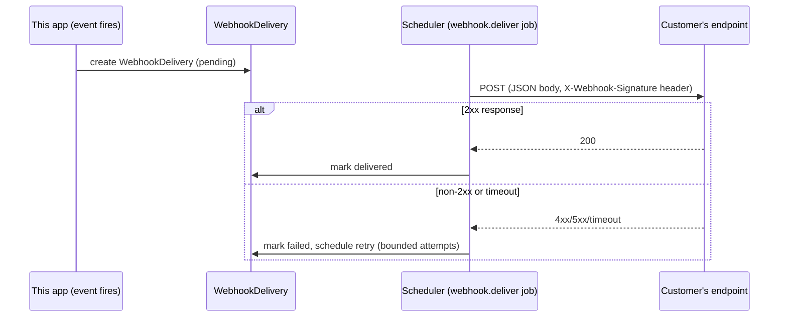

# Webhook Architecture

**Status: current.** Covers both directions: **inbound** (a provider
calls this app) and **outbound** (this app calls a customer-configured
URL, Module 6.5). Also see the pre-existing
[`API_DOCUMENTATION.md`](../../API_DOCUMENTATION.md) for WhatsApp's own
narrower, still-current detail.

---

## 1 · Inbound webhooks

| Route | Provider | Verification | Tenant routing |
|---|---|---|---|
| `GET`/`POST /api/webhooks/whatsapp` | Meta Cloud API | `GET` echoes `hub.challenge` if `hub.verify_token` matches (Meta's subscription handshake). `POST`: `X-Hub-Signature-256` HMAC verified against the **exact raw request body bytes** — a `401` on missing/invalid signature, never silently swallowed. | `metadata.phone_number_id` in the verified payload is looked up against `PhoneNumber` records (extended for Module 8.5) to resolve the owning organization before any further processing — one Meta App can serve every tenant's own WABA at the same URL. |
| `POST /api/webhooks/email` | Postmark | A shared token as `?token=...` on the URL (constant-time compared) — Postmark does not HMAC-sign inbound requests the way Meta does, so a shared secret in the URL is this provider's own real mechanism, not a weaker substitute chosen by this app. | Single platform-level inbound stream today — no per-tenant email webhook routing exists (a disclosed gap, same shape as payments below). |
| `POST /api/webhooks/payments/[provider]` | Razorpay / Stripe / Cashfree | Each provider's own `PaymentProvider.verifyWebhookSignature()`, computed over the **exact raw bytes received** (never a re-serialized/parsed-then-reserialized body — signature schemes are byte-sensitive). Returns `401` for an invalid signature. | Single platform-level webhook per provider — every event is stamped to the deployment's one connected account per provider today (a disclosed gap: real per-org payment webhook routing would need the same `phoneNumberId`-style resolution key WhatsApp already has, whenever a deployment first has two organizations each with their own connected payment account). |

**Expected response behavior — verified, not guessed:** a **verified**
signature that doesn't match any recognized event type still returns
`200`, never `500` — the provider's own retry behavior treats a non-2xx
as "redeliver," and an event this app doesn't act on is not a failure
worth triggering a redelivery storm for. An **invalid** signature
returns `401` — rejected outright, not logged-and-accepted.

**Idempotency**: payment webhook events are deduplicated via a real
DB-enforced partial unique index on `(provider, providerEventId)` — see
[`security.md`](security.md#6--idempotency) for why this exists (a
genuine concurrency race found and fixed during RC-3, not a
theoretical concern).

## 2 · Outbound webhooks (Module 6.5 — customer-configured)

A tenant Admin can register a `WebhookEndpoint` (URL + subscribed event
types) via `/api/admin/webhook-endpoints*` (10 routes: CRUD, enable/
disable, rotate secret, list deliveries, replay a specific delivery
attempt, send a test event). Every delivery is recorded as a
`WebhookDelivery` (one per event) with 1..N `WebhookDeliveryAttempt`
rows (one per HTTP attempt).

- **Signing**: every outbound payload is HMAC-signed with the
  endpoint's own per-tenant secret (`WEBHOOK_SECRET_ENCRYPTION_SECRET`
  encrypts it at rest) — `rotate-secret` invalidates the old value
  immediately, no grace-period dual-secret window.
- **Retry**: bounded attempts with backoff, matching the same
  `backoffMinutes[]` linear-retry shape the scheduler already uses for
  every other job type (see
  [`docs/integrations/automation.md`](../integrations/automation.md#queue--retry--dlq)) —
  not a separate retry engine.
- **Replay**: `POST /api/admin/webhook-endpoints/[id]/deliveries/[attemptId]/replay`
  is a manual, admin-triggered redelivery of one specific past attempt
  — not automatic, and never for a delivery whose event type RC-5's own
  replay-safety classification flags as unsafe to replay unattended
  (see `DR_RUNBOOK.md` §10).
- **Tenant isolation**: `WebhookEndpoint`/`WebhookDelivery`/
  `WebhookDeliveryAttempt` are all tenant-scoped
  (`tenantScopePlugin`) — Org B cannot see, enable/disable, or replay
  Org A's endpoint.

## 3 · Generic Webhooks & Team Notifications (Slack/Teams/Discord)

A related but distinct capability: `lib/services/webhooks/notifications/`
sends **outbound** team-notification messages (not customer-facing
webhook *subscriptions*) to a tenant-configured Slack/Microsoft Teams/
Discord incoming-webhook URL, via
`POST /api/admin/integrations/[providerId]/notification-test` for a
manual test send, and real trigger call sites elsewhere in the app
(e.g., a new lead, a failed payment). Confirmed live against Slack's
own real API (a real, specific `404: no_team` rejection for a
fake-but-well-formed webhook URL) — Teams/Discord are code-ready,
unverified against a live workspace in this environment (see
[`docs/integrations/matrix.md`](../integrations/matrix.md)).

## 4 · Webhook monitoring

`GET /api/admin/webhook-deliveries` — the original Module 2.4
"Webhook & API Monitoring" log of every **inbound** WhatsApp webhook
call received (recognized or not), independent of the Module 6.5
outbound-delivery tracking above. Don't confuse the two: one observes
what Meta sent this app, the other tracks what this app sent a
customer's own endpoint.
