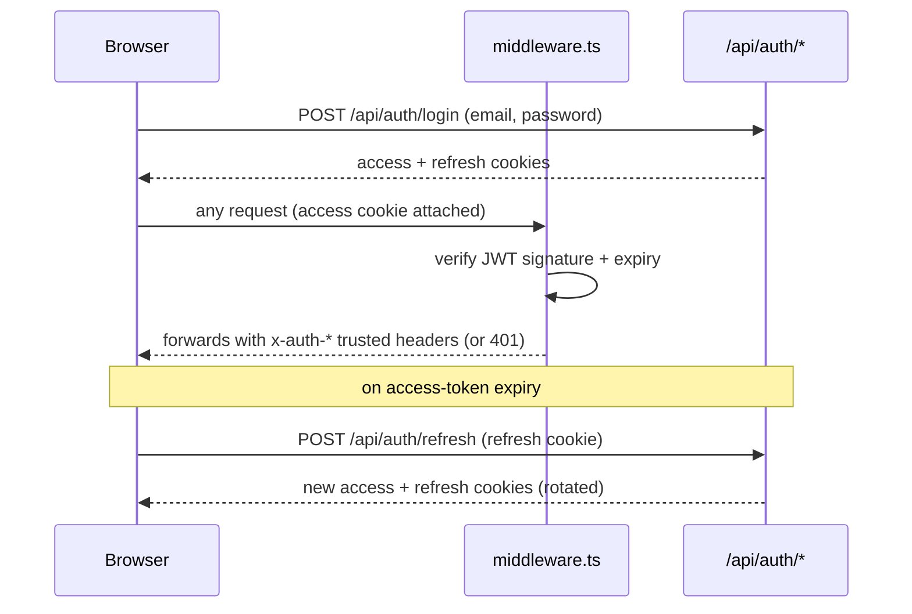

# Authentication Architecture

**Status: current.** Covers RC-1 (Authentication & Identity) as
extended by RC-7 (self-service registration, team invitations). Only
methods that actually exist and are wired end-to-end are documented
here — nothing aspirational.

---

## 1 · Session model

Stateless JWT access token (short-lived, `JWT_ACCESS_TOKEN_TTL_SECONDS`,
default 900s) + a refresh token (longer-lived, tracked in MongoDB via
`RefreshToken` for revocation, default `REFRESH_TOKEN_TTL_SECONDS` =
30 days, or `REFRESH_TOKEN_TTL_SECONDS_SHORT` = 12 hours when "Remember
me" is unchecked at login). Both are `httpOnly`, `SameSite=Lax`
cookies — the refresh-token cookie is `path`-scoped to `/api/auth` only
(it is never sent to any other route, including `/api/onboarding/*`).

`apiClient.ts`'s global contract: **any 401 from any route** (except
`/api/auth/login` itself) triggers one refresh attempt; if that also
fails, a hard `window.location.href = "/admin/login"` redirect. This is
why a route that can legitimately return 401 for a non-fatal reason
must be designed carefully — see RC-7's own disclosed lesson in
`RC_7_AUDIT.md` §20.

## 2 · Registration & verification

Two entry points, both producing a real `User`:

- **Self-service registration** (RC-7) — `POST /api/auth/register`:
  name, business email, password, terms acceptance. Creates a `User`
  with `role: "admin"` fixed and **no `organizationId`** (resolved
  later via the onboarding wizard — see
  [`docs/architecture/tenant.md`](tenant.md#8--onboarding-state-rc-7)).
  Auto-issues tokens (auto-login) and fires a verification email.
- **Invitation acceptance** (RC-7) — `POST /api/auth/invitations/accept`:
  name + password only (email and `organizationId`/`role` come from a
  validated `TeamInvitation`, not from the request). `emailVerifiedAt`
  is stamped immediately — receiving and clicking the invite link
  already proves control of that inbox, so no second verification email
  is sent.

Both reuse the same password-strength validation
(`validatePasswordStrength`) and the same verification-email mechanism.
`POST /api/auth/verify-email` confirms a token from that email;
`POST /api/auth/resend-verification` re-sends it. There is **no**
unauthenticated bulk-registration or admin-created-without-invite path
for a second organization's user — every non-first user of an
organization arrives via a `TeamInvitation`.

## 3 · Login / logout

`POST /api/auth/login` — email + password, rate-limited 10/15min. On
success: if MFA is enabled for the account, returns an MFA-pending
state instead of tokens (see §5); otherwise issues tokens directly.
Per-account brute-force lockout (`MAX_FAILED_LOGIN_ATTEMPTS`, default 5;
`LOCKOUT_DURATION_SECONDS`, default 900) is separate from the per-IP
rate limit on the route itself. `POST /api/auth/logout` revokes the
current refresh token.

## 4 · Password reset

`POST /api/auth/forgot-password` → email with a time-limited token
(`PASSWORD_RESET_TOKEN_TTL_SECONDS`, default 3600s) → `POST
/api/auth/reset-password`. Deliberately does not reveal whether an
email address has an account (constant response shape either way) —
see [`docs/security/overview.md`](../security/overview.md) for the
enumeration-resistance posture.

## 5 · MFA

Real RFC 6238 TOTP, not a stub:

- `POST /api/auth/mfa/setup` → QR code + secret
- `POST /api/auth/mfa/confirm` → verifies the first code, enables MFA,
  issues recovery codes
- `POST /api/auth/mfa/disable`
- `POST /api/auth/mfa/recovery-codes` — regenerate (invalidates the old
  set)
- `POST /api/auth/mfa/request-email-otp` — email-OTP **fallback** path
  for a user who's lost their authenticator app (not a second MFA
  factor stacked on top of TOTP — an alternative way to complete the
  same MFA challenge)
- Trusted devices (`GET`/`DELETE /api/auth/mfa/trusted-devices`) — skip
  MFA for a remembered device for `MFA_TRUSTED_DEVICE_TTL_SECONDS`
  (default 30 days)
- The TOTP secret itself is AES-256-GCM encrypted at rest
  (`MFA_ENCRYPTION_SECRET`), never stored plaintext

**Platform Super Admin routes additionally require MFA to be enabled on
the acting account** — enforced with a real DB read on every request,
fails closed on any lookup problem. See
[`docs/user-guides/platform-admin.md`](../user-guides/platform-admin.md).

## 6 · OAuth / Social Login

`GET /api/auth/oauth/providers` reports which are actually configured
(env-driven — an unconfigured provider simply doesn't appear, never a
broken button). Real adapters: **Google**, **Microsoft**; **GitHub**
optional. Deliberately **closed-world**: OAuth login never
auto-creates or auto-links a `User` by email match — there is no public
self-registration-via-OAuth path; an OAuth login only succeeds for an
email that already has a real account (linked explicitly via `POST
/api/auth/oauth/[provider]/authorize` while already signed in, or
completed via `GET /api/auth/oauth/[provider]/callback`). If the linked
account has MFA enabled, `POST /api/auth/oauth/mfa/verify` completes
the same MFA challenge login does.

This is a **separate OAuth app per purpose** from Calendar Connectors'
own Google/Microsoft/Zoom apps (`AUTH_GOOGLE_*` vs.
`GOOGLE_OAUTH_*` in `.env.example`) — different consent screen,
different scope, different redirect URI. Don't conflate the two when
configuring a deployment.

## 7 · Session & device management

- `GET /api/auth/sessions` — list active refresh-token sessions
- `DELETE /api/auth/sessions/[id]` — revoke one
- `POST /api/auth/sessions/revoke-others` — revoke every session except
  the current one
- `GET /api/auth/login-history` — recent login attempts (success and
  failure)
- `POST /api/admin/users/[id]/revoke-sessions` (RC-5, admin-only) — the
  one **cross-user** revocation path, for incident response (a
  different admin force-ending a *compromised* account's sessions, not
  self-service)

## 8 · Team invitations (RC-7)

Not a login method itself, but the on-ramp to one for every
non-first user of an organization:
`POST /api/admin/team/invitations` (admin-only) → single-use, 7-day
expiring, hashed token, org-bound → `POST /api/auth/invitations/accept`.
See [`docs/architecture/tenant.md`](tenant.md) and
`RC_7_AUDIT.md` §9 for the full seat-limit/cross-tenant-isolation
detail.

## 9 · What does NOT exist

Documented explicitly so it is never assumed present:

- No SAML/SSO/enterprise-IdP integration.
- No passwordless/magic-link login.
- No public "become an admin of an existing organization" path outside
  a `TeamInvitation` — an org's team can only grow via invitation.
- No API-key-based authentication for the admin API surface (every
  route in `docs/api/inventory.md` is either session-cookie
  authenticated, `CRON_SECRET`/`PLATFORM_ADMIN_SECRET` bearer-token
  authenticated for system routes, or genuinely public).

## 10 · Security controls summary

Rate limiting per route (see the table in
[`docs/api/inventory.md`](../api/inventory.md)), CSRF via
`SameSite=Lax` + explicit same-origin checks on public mutating routes,
brute-force lockout, constant-shape responses for account-enumeration-
sensitive routes, encrypted-at-rest MFA secrets, hashed (never
plaintext) tokens for every token-shaped entity (refresh, password
reset, email verification, team invitation). Full detail:
[`docs/security/overview.md`](../security/overview.md).
