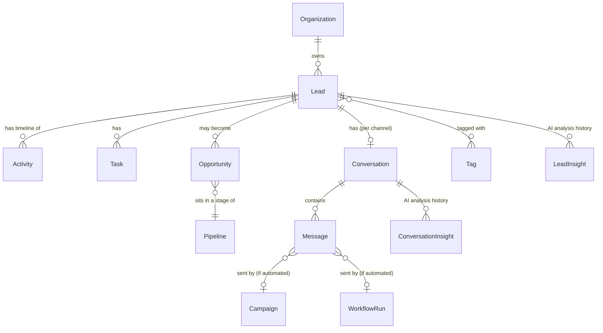
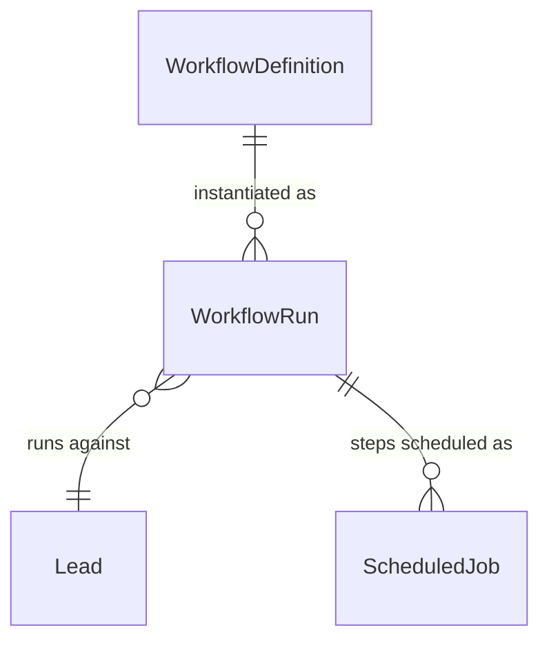

# Database Architecture

**Status: current.** MongoDB via Mongoose, 51 models
(`lib/db/models/*.model.ts`). This document covers domains and
relationships — not a field-by-field schema dump, which would go stale
the moment a field is added. **The Mongoose schema files themselves are
the authoritative, always-current field-level reference** — read the
relevant `*.model.ts` directly for exact field names/types/validators.

Every entity is selected between a MongoDB-backed and an in-memory
repository implementation via `lib/db/registry.ts` — see
[`docs/architecture/overview.md`](overview.md#1--system-shape`). Which
entities are tenant-scoped (auto-filtered by `organizationId`) is
covered in [`tenant.md`](tenant.md#3--which-entities-are-tenant-scoped) —
not repeated here.

---

## 1 · Domains

| Domain | Models | Service directory |
|---|---|---|
| **Identity & Auth** | User, RefreshToken, PasswordResetToken, EmailVerificationToken, MfaRecoveryCode, MfaEmailOtp, TrustedDevice, OAuthAccount | `lib/services/auth/` |
| **Tenant & Billing** | Organization, TeamInvitation, Plan, Subscription, UsageCounter, FeatureFlag, BrandConfiguration | `lib/services/organizations/`, `lib/services/billing/`, `lib/services/branding/`, `lib/services/onboarding/` |
| **CRM Core** | Lead, Activity, Task, Pipeline, Opportunity, AssignmentRule, CustomFieldDefinition, Tag, Attendance | `lib/services/crm/`, `lib/services/leads/` |
| **Communication** | Conversation, Message, MessageAttempt, PhoneNumber, AutoReplyRule | `lib/services/conversations/`, `lib/services/whatsapp/`, `lib/services/email/` |
| **Campaigns** | Campaign, WhatsappCampaign, CampaignTemplate | `lib/services/campaigns/`, `lib/services/whatsappCampaigns/` |
| **Automation** | WorkflowDefinition, WorkflowRun, ScheduledJob | `lib/services/automation/`, `lib/services/scheduler/` |
| **AI CRM** | LeadInsight, ConversationInsight | `lib/services/ai/`, plus consumers in `crm/` and `conversations/` |
| **Integrations & Credentials** | IntegrationConnection, IntegrationLog | `lib/services/integrations/`, `lib/services/tenantCredentials/` |
| **Files** | FileAsset | `lib/services/storage/` |
| **Payments** | Payment, PaymentWebhookEvent | `lib/services/payments/` |
| **Webhooks (outbound, Module 6.5)** | WebhookEndpoint, WebhookDelivery, WebhookDeliveryAttempt | `lib/services/webhooks/` |
| **Notifications** | Notification | `lib/services/webhooks/notifications/` |
| **Registrations** | Registration | `lib/services/registrations/` |
| **Meetings** | Meeting | `lib/services/calendar/` |
| **Ops / Audit** | AuditLog, BackupLog, DataExportRequest | `lib/services/auditLog/`, `lib/services/backupMonitoring/`, `lib/services/dataExport/` |

## 2 · Core CRM relationships

- A **Lead** is the CRM root entity a Conversation, Opportunity, Task,
  and Activity all attach to.
- An **Opportunity** moves through a **Pipeline**'s stages;
  `Opportunity.stageHistory` (added for Module 7.1) records every
  transition for duration/conversion analytics — pre-existing
  opportunities before that module only have their *current* stage
  backfilled, not full history (a disclosed approximation).
- A **Message** created by the automation engine or a campaign carries
  `workflowRunId`/`campaignId` so Automation/Revenue Analytics (Module
  7.2) can distinguish an automated send from a manually-sent one —
  neither field existed before Module 7.2 needed the distinction.

## 3 · Tenant & billing relationships

See the full diagram in
[`tenant.md`](tenant.md#1--the-core-hierarchy) and
[`tenant.md`](tenant.md#6--subscription-entitlements-usage-module-83) —
not repeated here to avoid the two documents drifting apart.

## 4 · Automation relationships

See [`docs/integrations/automation.md`](../integrations/automation.md)
for the full trigger → workflow → condition → action → queue → retry →
DLQ lifecycle.

## 5 · Audit logging

`AuditLog` is written by `lib/services/auditLog/` for real business
events (not every read, not every duplicate/no-op) — see the
pre-existing [`AUDIT_ARCHITECTURE.md`](../../AUDIT_ARCHITECTURE.md) for
the original design review, still current. `AuditLog.entityType` is a
**hand-maintained Mongoose schema enum, deliberately kept in sync with
a TypeScript union by a dedicated guard test**
(`auditLog.model.unit.test.ts`) — this exact class of bug (a new entity
type added to the TS union but not the Mongoose enum, silently
swallowing every audit write for it) has recurred multiple times across
this project's history; the guard test is what catches it now, not
developer memory.

## 6 · Migrations

Schema changes in this codebase are additive-only within a deploy
window (no destructive in-place migrations are run automatically at
boot — see [`docs/development/migrations.md`](../development/migrations.md)
and [`docs/deployment/deployment.md`](../deployment/deployment.md)).
Index creation is a deliberate, operator-triggered step
(`npm run db:sync-indexes`), never automatic — `autoIndex` is disabled
in production.

## 7 · Backup & recovery

Not repeated here — see [`DR_RUNBOOK.md`](../../DR_RUNBOOK.md) (RC-5),
the authoritative, still-current source for backup strategy, RPO/RTO
per data classification, restore procedure, and per-job replay-safety
classification.
