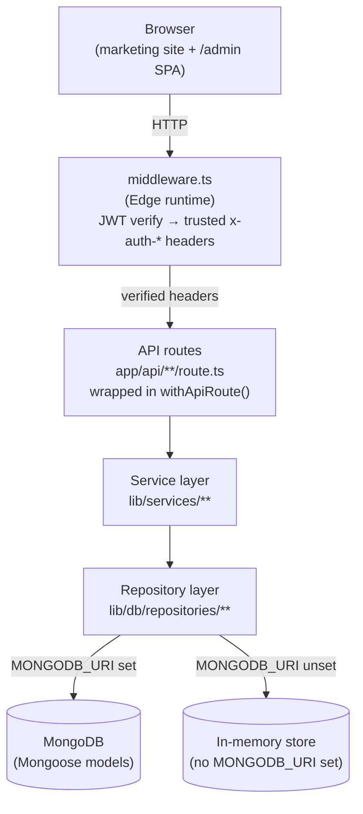
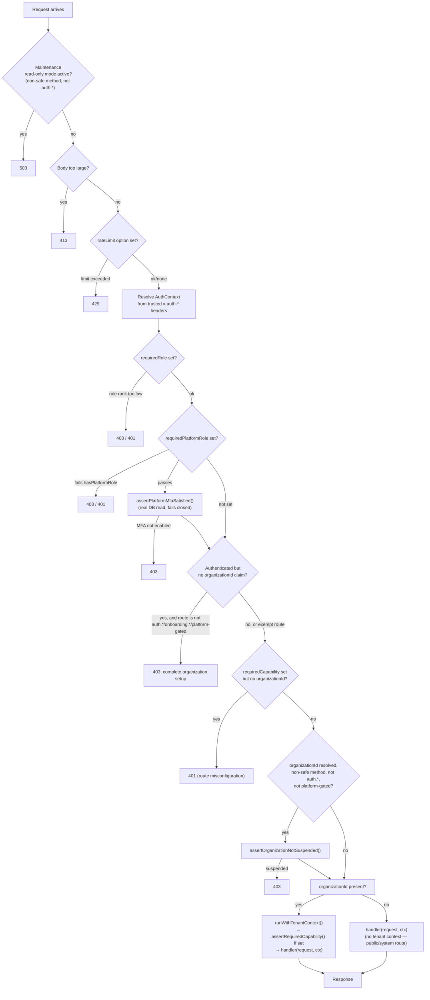

# Architecture Overview

**Status: current.** Describes the system as it actually exists in this
repository today, not the original blueprint (see
[`docs/README.md#source-of-truth`](../README.md#source-of-truth)).

---

## 1 · System shape

`lib/db/registry.ts` is what actually picks Mongo vs. in-memory, **per
entity**, via a `getXRepository()` function for each domain — not a
single global switch. Both implementations satisfy the same
TypeScript interface, so services never know which one they're talking
to. The in-memory store exists so the app runs with zero configuration
locally and in CI; it never persists across a process restart and is
not shared across concurrent serverless instances — never used in
production.

## 2 · Request lifecycle (`withApiRoute`)

Every authenticated/tenant-aware API route is wrapped in
`lib/api/withApiRoute.ts`. This is the actual, verified order of checks
— not an approximation:

Every rejection branch above (`requiredRole`, `requiredPlatformRole`,
the pre-organization gate) also fires an async, non-blocking write to
`securityAuditLogService` — a forbidden *attempt* leaves a real audit
trail even though it's rejected. See
[`docs/security/overview.md`](../security/overview.md).

**Two genuinely different "no organizationId" cases**, handled
differently on purpose:

1. **Not authenticated at all** — no session token. No tenant context
   is established. A handful of genuinely public routes (`POST
   /api/leads`, `POST /api/registrations`, inbound webhooks) work this
   way by design; their own service functions stamp the deployment's
   default organization explicitly.
2. **Authenticated, but the token carries no `organizationId` claim** —
   the real shape of a mid-registration RC-7 user's session before they
   create/join an organization. Rejected everywhere **except** routes
   named `auth.*` or `onboarding.*`, or gated by `requiredPlatformRole`
   (a platform operator has no tenant org by design). See
   [`docs/architecture/tenant.md`](tenant.md) for why this boundary is
   structural, not a convention.

## 3 · Layers

| Layer | Location | Responsibility |
|---|---|---|
| Middleware | `middleware.ts` | Edge-runtime JWT verification; converts a validated token into trusted `x-auth-*` headers; strips any client-supplied ones. Only routes covered by its `matcher` array get this treatment — a route outside the matcher trusts nothing, by omission, not by a bypass. |
| API routes | `app/api/**/route.ts` | Thin — parse/validate request, call one service method, map the result to an HTTP response. Every route is named (`withApiRoute("domain.action", ...)`) and that name is the identity used for RBAC exemptions, audit entries, and rate-limit buckets. |
| Services | `lib/services/**` | All business logic. One directory per domain (`auth`, `crm`, `whatsapp`, `automation`, `billing`, `onboarding`, `platformAdmin`, ...). Services call repositories, never Mongoose/the in-memory store directly. |
| Repositories | `lib/db/repositories/**` | One Mongo + one in-memory implementation per entity, same interface. `lib/db/registry.ts` selects between them. |
| Models | `lib/db/models/**` | 51 Mongoose schemas. Tenant-scoped entities apply `tenantScopePlugin` (see [tenant.md](tenant.md)). |

## 4 · Cross-cutting concerns

| Concern | Where | Notes |
|---|---|---|
| Tenant context | `lib/tenancy/context.ts` | `AsyncLocalStorage`-based; see [tenant.md](tenant.md) |
| RBAC | `lib/api/roles.ts` | Rank-based tenant role check + a structurally separate platform-role check; see [rbac.md](rbac.md) |
| Queue | `lib/services/scheduler/` | A real MongoDB-backed job queue, drained by Vercel Cron hitting `/api/cron/run-due-jobs` every 5 minutes — not Redis/BullMQ (see [ADR-0003](../development/adr/0003-queue-architecture.md)) |
| Workers | none (serverless) | Job execution happens inside the same cron-triggered serverless invocation, with an internal 45s time budget so a batch never risks a mid-job kill; see [RUNBOOK.md](../../RUNBOOK.md) |
| Cron | `vercel.json` | One cron entry, `/api/cron/run-due-jobs`, `CRON_SECRET`-authenticated |
| Credential resolver | `lib/services/tenantCredentials/` | Per-organization encrypted provider credentials, resolved ahead of any deployment-wide env default; see [tenant.md](tenant.md) |
| Storage | `lib/services/storage/` | Pluggable: `local` (dev only) / `aws_s3` / `cloudinary`; platform-level, not per-tenant |
| Observability | `lib/services/errorTracking/`, `lib/services/scheduler` metrics, `/api/health`, `/api/health/ready`, `/api/admin/system/preflight` | Provider-neutral webhook-based error forwarding (`disabled` by default); see [RUNBOOK.md](../../RUNBOOK.md) |

## 5 · Diagrams by domain

Deeper, domain-specific diagrams live next to their subject rather than
duplicated here:

- Multi-tenancy: [`tenant.md`](tenant.md)
- Auth/session lifecycle: [`auth.md`](auth.md)
- RBAC matrix: [`rbac.md`](rbac.md)
- Data model: [`database.md`](database.md)
- Automation engine (trigger → workflow → queue → retry → DLQ):
  [`../integrations/automation.md`](../integrations/automation.md)
- WhatsApp architecture: [`../integrations/whatsapp.md`](../integrations/whatsapp.md)
  (also see the pre-existing [`WHATSAPP_ARCHITECTURE.md`](../../WHATSAPP_ARCHITECTURE.md)
  and [`CAMPAIGN_ARCHITECTURE.md`](../../CAMPAIGN_ARCHITECTURE.md), both
  still current for their own narrower scope)

## 6 · What this app deliberately does NOT have

Documenting the absence explicitly, so it's never assumed by omission:

- **No separate worker/queue service.** The MongoDB-backed scheduler
  IS the queue. Evaluated and rejected during RC-3 — see
  [ADR-0003](../development/adr/0003-queue-architecture.md).
- **No microservices.** One Next.js application, one deployment unit.
- **No GraphQL.** Every API is REST-shaped JSON over HTTP.
- **No server-side session store.** Sessions are stateless JWTs
  (access + refresh), with refresh tokens tracked in MongoDB only for
  revocation purposes.
- **No dedicated CSRF token.** CSRF defense is uniform `SameSite=Lax`
  cookies plus an explicit same-origin check on the few genuinely
  public mutating routes — see [`docs/security/overview.md`](../security/overview.md).
