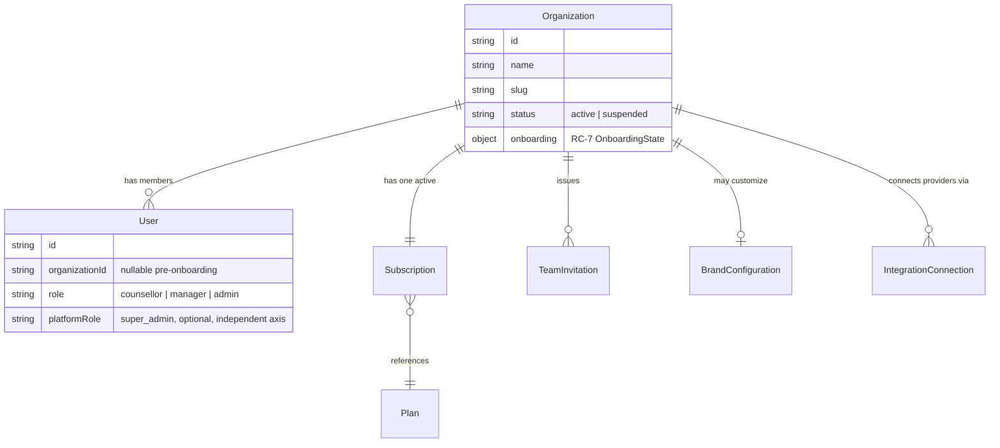
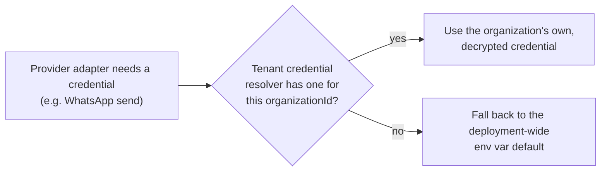
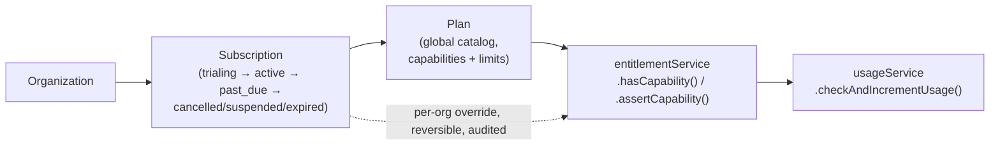

# Tenant Architecture

**Status: current.** Covers Business OS Module 8.1 (Tenant Data
Isolation), 8.2 (Tenant Context & Credentials), 8.3 (Billing, Plans &
Feature Flags), 8.4 (White Label & Branding), and RC-7 (Customer
Onboarding). Every claim below is verified against the current schema
and plugin registration, not assumed from module names.

---

## 1 · The core hierarchy

There is no separate "Membership" collection — a `User` document
**is** the membership: `User.organizationId` + `User.role` together
express "this person belongs to this organization at this rank."
(The mission's RC-8 brief names "Membership" as a concept to document;
in this codebase that concept is realized as a field on `User`, not a
join table — documenting it as a separate entity would misrepresent
the schema.)

## 2 · Tenant context — the enforcement mechanism

`lib/tenancy/context.ts` — a single `AsyncLocalStorage<TenantContext>`
carrying `{organizationId, userId, role}`. Established in exactly two
places:

1. `lib/api/withApiRoute.ts`, for every authenticated HTTP request with
   a resolved `organizationId` (see
   [`overview.md`](overview.md#2--request-lifecycle-withapiroute)).
2. The scheduler/automation-engine job-processing loops, once per job,
   using that job's own `organizationId` — never a request's.

Everywhere else (scripts, seed/migration code, the unit test suite's
direct repository calls) runs with **no context**, which the scoping
layer below treats as a no-op, not an error.

`lib/db/tenantScopePlugin.ts` (Mongoose) and
`lib/db/inMemoryTenantScope.ts` (in-memory store) read this context and
auto-merge `organizationId` into every `find`/`findOne`/
`findOneAndUpdate`/etc. query. **With no context active, this is a
no-op** — a real, disclosed trade-off: protection is real for every
request/job this app actually serves traffic through, proven by a
dedicated cross-tenant attack suite (`tests/e2e/tenantIsolation.spec.ts`),
not a database-level guarantee independent of the application ever
calling `runWithTenantContext()` correctly.

A cross-tenant query for another organization's document simply
**matches nothing** — treated identically to "id doesn't exist" (a 404,
never a distinguishing 403), so a caller can never learn *whether* a
resource exists in a different organization, only that they can't see
it.

## 3 · Which entities are tenant-scoped

**38 of 51 models** carry `tenantScopePlugin`. The 13 that deliberately
do not, and why:

| Model | Why it's not tenant-scoped |
|---|---|
| `Organization` | The tenant root itself — scoping it to itself is meaningless |
| `User` | Spans identity concerns (login) that predate/exceed org membership; also read cross-org by Platform Admin |
| `RefreshToken` | Tied to a `User`, not an org |
| `ScheduledJob` | The queue itself is platform infrastructure; individual job payloads carry their own `organizationId` when relevant |
| `Plan` | Global commercial catalog — the same Plan document is referenced by every subscribed organization |
| `FeatureFlag` | Deployment-level configuration, distinct from a Plan's per-organization `capabilities` |
| `BackupLog` | System-level operational record (RC-5) |
| `EmailVerificationToken`, `PasswordResetToken`, `MfaEmailOtp`, `MfaRecoveryCode`, `TrustedDevice`, `OAuthAccount` | Pre-session identity/auth artifacts tied to a `User`, resolved before any tenant context could exist |

Everything else — Lead, Activity, Task, Pipeline, Opportunity,
Conversation, Message, Campaign, WorkflowDefinition/WorkflowRun,
IntegrationConnection, Subscription, TeamInvitation, AuditLog, and 25
more — is tenant-scoped.

## 4 · Escape hatch: cross-tenant reads for platform operators

`runCrossTenantSweep()` is the one deliberate way to query a
tenant-scoped collection **without** an ambient tenant context — used
exclusively by Platform Super Admin aggregate views (organization
counts, subscription counts, the onboarding funnel) that must
legitimately see across every organization. It is not reachable from
any tenant-facing route; every one of its call sites lives behind
`requiredPlatformRole: "super_admin"`.

## 5 · Tenant credentials (Module 8.2)

`lib/services/tenantCredentials/` — per-organization, AES-256-GCM
encrypted credential storage for provider integrations (AI, Email,
WhatsApp manual entry, OAuth tokens for Calendar). A provider adapter
calls `getTenantContext()?.organizationId` and checks the resolver
**before** its own deployment-wide env default:

This is the same resolution order for every provider that supports
tenant-level credentials: WhatsApp (or the deployment default, or
Embedded Signup discovery — see
[`../integrations/whatsapp.md`](../integrations/whatsapp.md)), Email
(Postmark), AI (OpenAI/Anthropic/Gemini — BYOK), and Calendar OAuth
tokens. A credential value is **never** returned to the browser after
being saved — the API only ever reports Configured/Missing/Expired,
matching the same convention the Platform Console uses (see
[`docs/security/overview.md`](../security/overview.md)).

## 6 · Subscription, entitlements, usage (Module 8.3)

- **Self-healing, not a backfill**: any organization with no explicit
  `Subscription` yet is transparently, race-safely provisioned onto a
  real, zero-price internal plan the first time its entitlements are
  checked — this protects every future organization, not just ones
  that existed at migration time.
- **Per-organization overrides** (Platform Admin only — RC-6) merge
  **on top of**, never replace, the shared Plan's own capabilities/
  limits. The global Plan catalog itself is never mutated by a
  per-organization action.
- **Server-side enforcement** exists at 5 representative call sites
  (seats, WhatsApp send, automation execution, AI requests, file
  storage) — a deliberate, disclosed "representative, not universal"
  scope, not every conceivable route. `leads`/`integrations`/
  `webhook_deliveries` limits and some plan-schema capabilities exist
  but are not yet checked anywhere.
- **No real recurring/auto-charge billing exists.** None of the three
  real payment gateways (Razorpay/Stripe/Cashfree) have their own
  Subscriptions/Billing API wired here — this app's real, tested piece
  is the subscription *state machine* reacting to a renewal Payment's
  outcome, not an automatic scheduled charge.

## 7 · Branding (Module 8.4)

One `BrandConfiguration` per organization, gated by
`entitlementService.hasCapability(orgId, "white_label")` (never a
hardcoded plan-name check). Exactly four CSS custom properties are
overridable (`--adm-accent`/`-hover`/`-soft`/`-2`) — text/surface/border
tokens are never touched, which is what makes "tenant branding cannot
destroy usability" true by construction. Real WCAG 2.1 contrast math
rejects an unreadable accent color server-side before it's ever saved.
Branded login (resolving which organization is signing in from a
custom domain, before authentication) is a disclosed, unbuilt gap —
`middleware.ts` runs on the Edge runtime with no DB access and no
custom-domain-to-organization mapping exists in the schema.

## 8 · Onboarding state (RC-7)

`Organization.onboarding` (`OnboardingState`) persists wizard progress
server-side — never localStorage — so a user can resume from the
correct step on a later login. See
[`docs/user-guides/onboarding.md`](../user-guides/onboarding.md) for
the full step-by-step flow and `RC_7_AUDIT.md` for the architectural
detail (the pre-organization gate, atomic organization creation,
activation definition).

## 9 · The security boundary, stated plainly

- A request's tenant identity comes **only** from a JWT claim verified
  by `middleware.ts` — never from a client-supplied header, body field,
  or query parameter. `getAuthContext()` reads exclusively from
  `x-auth-*` headers that only `middleware.ts` is trusted to set.
- A route outside `middleware.ts`'s `matcher` array gets **no**
  verification at all for those headers — every new authenticated route
  prefix must be added to that matcher, or it silently trusts whatever
  a client sends. This has been a real, found-and-fixed bug class twice
  in this project's history (RC-1's own new auth routes; RC-7's new
  `/api/onboarding/*` routes) — see [`docs/security/overview.md`](../security/overview.md).
- An authenticated request with **no** `organizationId` claim is
  rejected outright from every route except `auth.*`/`onboarding.*`/
  platform-gated ones — never silently defaulted into any real
  organization. See [`overview.md`](overview.md#2--request-lifecycle-withapiroute).
