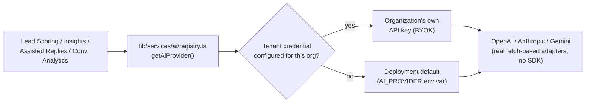

# AI CRM

**Status: current.** Covers Phase 5 (AI Lead Scoring & Insights,
AI-Assisted Replies, Conversational Analytics).

---

## 1 · Deterministic scoring vs. AI-generated scoring — a real distinction

This app has **two separate, coexisting** lead-scoring mechanisms, not
one AI feature layered on top of nothing:

| | Rules-based (`ScoringProvider id: "rules-based"`) | AI (`ScoringProvider id: "ai"`) |
|---|---|---|
| Runs | On every lead write (the hot path) | On-demand ("Analyze Again") or via the `analyze_lead_ai` automation action |
| Default | **Yes** — `leadService.recomputeAndPersistScore()` always calls `rules-based` | No — never the default; opt-in per lead/workflow |
| Output | A numeric score + band (hot/warm/cold) | The same band vocabulary (via a shared `bandHealth()` helper — an AI-generated "hot/warm/cold" always means the identical banding rules-based uses, never a second, driftable definition) plus a persisted narrative: summary, buying intent, strengths, risks, next action, confidence, reasoning |
| Failure mode | Cannot fail (pure function over lead data) | Degrades to a real persisted `"unavailable"`/`"error"` row — never fabricates a score |

The AI provider's own subjective "hot/warm/cold" label is never trusted
directly for anything the rules-based score already governs — it's
presented as AI *insight*, additive to the deterministic score, not a
replacement for it.

## 2 · The three AI features

| Feature | What it does | Persisted history |
|---|---|---|
| **Lead Scoring & Insights** (5.1) | One AI call per analysis, gathering the Lead's Activities + its Conversation's recent Messages + Opportunities as context | `LeadInsight` — one row per run |
| **AI-Assisted Replies** (5.2) | Suggests a tone-specific reply (Professional/Friendly/Concise/Follow-up) for a Conversation — **never sends automatically**; a counsellor inserts it into the composer and sends manually, the same `conversationService.sendReply()` path as any hand-typed message | Deliberately stateless — no history persisted (no stated purpose for storing draft text nobody sent) |
| **Conversational Analytics** (5.3) | Sentiment, intent, engagement/buying-readiness scores, signals, objections, a chronological summary, key topics, missed opportunities, suggested actions | `ConversationInsight` — one row per run; `getLeadHistory(leadId)` is a read-only aggregation over already-persisted insights, not a new AI call |

"AI only suggests, never sends" is true **by construction** for 5.2,
not just policy — `generateReply()`'s return type is a plain suggestion
object; there is no code path from it directly to a send.

## 3 · Provider architecture

All three vendor adapters (`lib/services/ai/providers/`) are real,
independent fetch-based implementations — no shared SDK dependency.
`AI_PROVIDER` unset → every AI feature degrades gracefully (real
"unavailable" state), never a fake result. See
[`docs/integrations/matrix.md`](matrix.md#4--ai-lead-scoring-insights-assisted-replies-conversational-analytics)
for exactly which vendors have been live-verified vs. code-ready-only.

## 4 · Tenant credentials (BYOK)

Supported via Module 8.2's tenant credential resolver — the same
resolution order as WhatsApp/Email: an organization's own API key
(entered via Settings → Integrations) overrides the deployment-wide
`AI_PROVIDER`/`*_API_KEY` default for that organization's own requests
only. Never stored in browser storage — encrypted at rest, resolved
server-side only.

## 5 · Usage accounting

AI requests are one of the 5 representative call sites where Module
8.3's entitlement/usage-limit layer is actually wired
(`ai/registry.ts#getAiProvider()`, covering all real callers
automatically) — a plan without AI capability, or an organization that
has exhausted its AI request limit, is rejected before the request
reaches a vendor. See
[`docs/architecture/tenant.md`](../architecture/tenant.md#6--subscription-entitlements-usage-module-83).

## 6 · Failure / fallback behavior

Every AI feature follows the same rule: an unconfigured provider, a
vendor rejection, or a vendor timeout all produce a real, honestly
labeled `"unavailable"` or `"error"` state — visible in the UI, logged,
never silently retried into a fabricated success and never presented
as if it were a real result. This has been directly, live-verified
multiple times across this project's history using a real, intentionally
invalid Anthropic API key (a genuine `401` correctly surfacing end to
end, not a mocked test).
