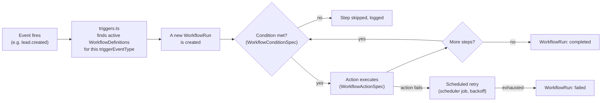

# Automation Platform

**Status: current.** Covers Phase 3 (Persisted Workflow Definitions,
Visual Workflow Builder, Auto-Reply Engine). The real trigger/action/
condition catalog below is extracted directly from
`lib/services/automation/types.ts` — nothing here is invented ahead of
what the engine actually supports.

---

## 1 · Lifecycle

A `WorkflowRun` is one instantiation of a `WorkflowDefinition` against
one triggering event (usually a `Lead`). Steps within a run advance
sequentially; a condition that isn't met skips that step (logged, not
silently dropped) rather than failing the whole run.

## 2 · Real trigger events

`WorkflowDefinition.triggerEventType` is a free-form string matched
against real events this app's event bus (`lib/events/`) actually
publishes — not a fixed enum. Every event type currently published
anywhere in the codebase:

| Event | Published by |
|---|---|
| `lead.created` | Lead creation (public form, CSV import, API) |
| `lead.updated` | Any lead field update |
| `lead.assigned` | Assignment (manual or `AssignmentRule`) |
| `lead.converted` | Lead → Opportunity conversion |
| `task.created` | Task creation |
| `task.completed` | Task marked complete |
| `task.overdue` | Scheduler-detected overdue task |
| `message.received` | Inbound WhatsApp/email message |
| `registration.created` | New course/program registration |
| `payment.success` / `payment.failed` / `payment.refund` | Payment webhook outcomes |
| `workflow.started` / `workflow.completed` / `workflow.failed` | The automation engine's own run lifecycle (lets one workflow react to another, used sparingly) |

A `WorkflowDefinition` naming an event type not in this list simply
never fires — there is no validation-time error for a typo'd event
name today (a real, disclosed gap, not a feature).

## 3 · Conditions

Exactly **one** real condition type exists: `lead_not_registered`.
This is not an oversight — the condition catalog grows only when a
real workflow needs one; it isn't pre-built speculatively. A condition
spec carries a human-readable reason surfaced in logs when a step is
skipped.

## 4 · Actions

The full, real action catalog (`WorkflowActionType`):

| Action | Params | Notes |
|---|---|---|
| `send_whatsapp_template` | template + variables | Reuses the real WhatsApp send pipeline — see [`whatsapp.md`](whatsapp.md) |
| `send_email` | subject + body | Plain text, no templating — matches `EmailProvider`'s own no-template design |
| `assign_lead` | assignee | |
| `add_tag` | tag | |
| `create_task` | title + due date etc. | |
| `analyze_lead_ai` | none | AI CRM (5.1) — analyzes the Lead this step runs against; degrades to a persisted "unavailable" row if no AI provider is configured, never fabricates a result |
| `analyze_conversation_ai` | none | AI CRM (5.3) — analyzes the Lead's most-recently-active Conversation, if any; no-ops gracefully if none exists |
| `schedule_meeting` | title, duration, provider | Module 6.3 — schedules a real Calendar meeting against the Lead |

The **Visual Workflow Builder** (`components/admin/automation/WorkflowStepBuilder.tsx`)
is the one source of truth for which params each action needs
(`defaultParamsFor()`'s switch) — the server additionally validates
required params per action type
(`lib/services/automation/validation.ts`'s `validateActionParams()`),
not just the client.

## 5 · Auto-Reply Engine — a deliberately separate, smaller system

Module 3.3's `AutoReplyRule` catalog (`lib/services/automation/autoReply/`)
is **not** built on the `WorkflowDefinition`/`WorkflowRun` engine above
— a real architectural decision, not an oversight. The workflow engine
models multi-day, per-Lead sequences; an auto-reply is an immediate,
per-Conversation response to an inbound message — the wrong shape for
the same machinery. Don't assume the two share execution code.

## 6 · Queue, retry, DLQ

Both engines execute through the same real queue — this app's
MongoDB-backed scheduler (`lib/services/scheduler/`), drained by
Vercel Cron. There is no separate automation-specific queue. See
[`docs/architecture/overview.md`](../architecture/overview.md#4--cross-cutting-concerns)
for the queue architecture itself and
[`RUNBOOK.md`](../../RUNBOOK.md)/[`DR_RUNBOOK.md`](../../DR_RUNBOOK.md)
for operational detail (retry backoff, dead-letter handling, replay
safety per job type — `automation.tick` is classified there alongside
every other real job type).

## 7 · Analytics

Automation & Revenue Analytics (Module 7.2) reads `WorkflowRun` as the
one real execution source of truth — `WorkflowContext.runId` and
`Message.workflowRunId`/`Task.workflowRunId` (added specifically for
this) distinguish an automated send/task from a manually-created one.
See `GET /api/admin/analytics/revenue` in
[`docs/api/inventory.md`](../api/inventory.md#automation).

## 8 · What doesn't exist

- No visual drag-and-drop canvas — the Visual Workflow Builder
  (Module 3.2) is a structured form driven by the same action/condition
  registries the server validates against, a disclosed scope call, not
  a missing feature.
- No Conversation-scoped trigger in the engine itself — `WorkflowRun`
  only ever runs against `Lead` entities; `analyze_conversation_ai`
  works around this by resolving the Lead's own most-recently-active
  Conversation rather than triggering directly off a Conversation
  event.
- No retry-count history beyond the current step — `WorkflowRun.attempts`
  resets on every step advance, a disclosed limitation on Automation
  Analytics' own retry-rate metric (Module 7.2 §6).
