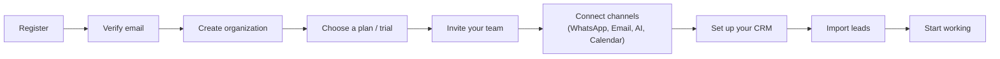

# Customer Onboarding Guide

**Status: current (RC-7).** What a new business owner actually
experiences signing up — written for that audience, in plain language,
matching the product's own onboarding copy (no "WABA ID"/"OAuth Client
Secret"/webhook jargon). For the underlying architecture, see
[`docs/architecture/tenant.md`](../architecture/tenant.md#8--onboarding-state-rc-7)
and `RC_7_AUDIT.md`.

---

## The path

Every step except account creation and organization setup is
**optional and resumable** — you can skip a step, leave, and come back
later exactly where you left off. Nothing is silently marked "done"
just because you skipped it.

## 1 · Register

`/admin/register` — name, business email, password. You're logged in
immediately after registering.

## 2 · Verify your email

A verification link is emailed to you. Until you click it, you can't
create your organization yet — this protects the next step (which
creates real billing/trial state) from being reachable by an unverified
address.

## 3 · Create your organization

Just the essentials: business name, industry (optional), team size,
website (optional), country. Not a long questionnaire. You become that
organization's Admin automatically.

## 4 · Choose a plan

A free 14-day trial is available with no card required. Which plans
you see depends on what's actually offered — the product never shows
you a plan it can't actually give you.

## 5 · Invite your team

Add people by email and role (Counsellor, Manager, or Admin). Each
invitation is a real, single-use, expiring link — you can resend or
revoke one anytime. You can only invite as many people as your plan's
seat limit allows; the product tells you honestly if you're at the
limit rather than letting the invite silently fail.

## 6 · Connect your channels

- **WhatsApp** — "Connect WhatsApp" walks you through linking your own
  WhatsApp Business Account. No copying tokens or IDs. Only available
  if your plan includes it.
- **Email** — connect your email sending account, or skip if you're
  not ready.
- **AI** — if your plan includes AI features, nothing to configure. If
  it supports bringing your own AI provider key, you can add one here.
- **Calendar** — optional, connect if you want meetings booked
  directly into it.

None of these are forced — skip any of them and connect later from
Settings.

## 7 · Set up your CRM

A default pipeline with standard stages is created automatically —
customize it, or start using it as-is.

## 8 · Import your leads

Upload a CSV — the product shows you exactly how your columns will map
in, flags likely duplicates, and gives you a preview before anything
is actually imported. Skip this if you don't have an existing list
yet.

## 9 · You're activated

Once your CRM is set up, your team is invited (or you've intentionally
skipped that for now), and you've either connected a channel or
consciously decided not to yet — you're considered a fully activated
customer. A lightweight checklist stays on your dashboard for anything
you skipped, without ever forcing you back through the full wizard.

## If you get stuck

See [`docs/operations/troubleshooting.md`](../operations/troubleshooting.md)
for verification-email and connection issues, or contact support with
what [`docs/operations/support-diagnostics.md`](../operations/support-diagnostics.md)
describes as safe to share — never your password, a verification code,
or any credential.
